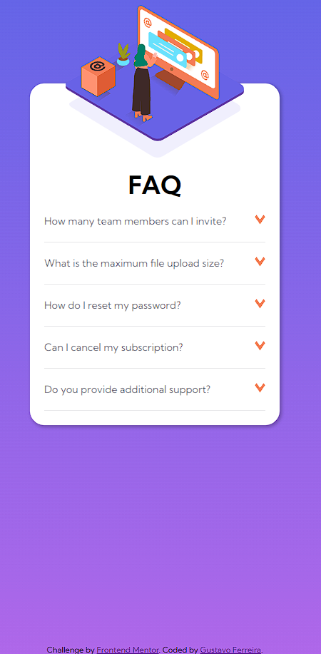

# Frontend Mentor - FAQ accordion card solution

This is a solution to the [FAQ accordion card challenge on Frontend Mentor](https://www.frontendmentor.io/challenges/faq-accordion-card-XlyjD0Oam). Frontend Mentor challenges help you improve your coding skills by building realistic projects. 

## Table of contents

  - [Screenshot](#screenshot)
  - [Links](#links)

  - [Built with](#built-with)
 

### Screenshot

### Links

- Solution URL: [Add solution URL here](https://github.com/Gusstavow/faq-accordion-card-main)
- Live Site URL: [Add live site URL here](https://gusstavow.github.io/faq-accordion-card-main/)

### Built with

- Semantic HTML5 markup
- CSS custom properties
- Flexbox

- Mobile-first workflow

